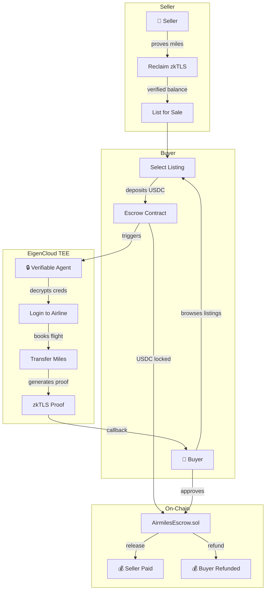
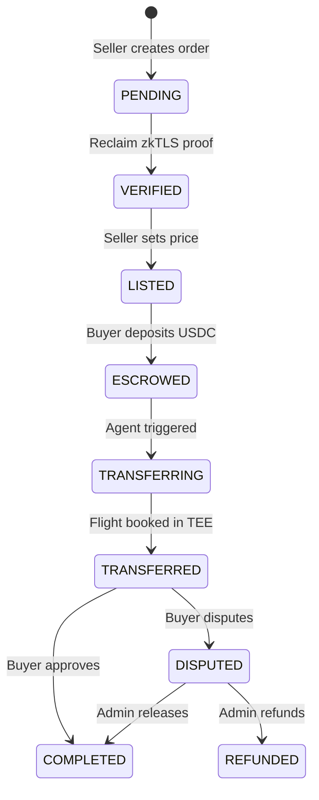

# ✈️ SkyEscrow — Trustless Airmiles Marketplace

> **A verifiable agent marketplace where airline miles are traded trustlessly using zkTLS proofs, on-chain escrow, and autonomous execution inside Intel TDX TEEs on EigenCloud.**

Built for the [EigenCloud Open Innovation Challenge](https://eigencloud.xyz) 🏗️

---

## 🎯 The Problem

Airmiles are worth **billions** but trapped in walled gardens. Trading them today requires:
- ❌ Trusting strangers with airline credentials
- ❌ No proof that sellers actually have the miles they claim
- ❌ No guarantee buyers will receive their tickets
- ❌ Manual, error-prone, and ripe for fraud

## 💡 The Solution

SkyEscrow is a **multi-player verifiable agent** that removes all trust from airmiles trading:

```
Seller proves miles → Lists for sale → Buyer funds escrow → 
Agent books ticket inside TEE → Buyer verifies → Funds released
```

Every step is **cryptographically verifiable**. No one — not even the platform operator — can access seller credentials or manipulate the process.

---

## 🏗️ Architecture



---

## 🔐 Why EigenCloud?

This is a **multi-player agent** that handles sensitive credentials, real money, and autonomous actions. It **needs** verifiability:

| Property | How SkyEscrow Achieves It |
|---|---|
| **Code Integrity** | Docker image attested via Intel TDX — only verified code runs |
| **Data Privacy** | Seller credentials encrypted with TEE public key, decrypted only inside hardware-isolated memory |
| **Verifiable Execution** | zkTLS proof that the airline actually processed the booking |
| **Trustless Settlement** | On-chain USDC escrow — funds locked until buyer confirms |
| **Sovereign Operation** | Agent operates autonomously inside TEE — no human can intercept |

> *"Single-player agents can run anywhere. Multi-player agents need trust: verifiability and privacy."* — Sreeram Kannan

SkyEscrow is exactly this: a multi-player agent serving buyers and sellers, where **trust comes from cryptographic proofs, not promises**.

---

## 📊 Order Lifecycle



---

## 🛠️ Tech Stack

| Layer | Technology |
|---|---|
| **Verification** | [Reclaim Protocol](https://reclaimprotocol.org) — zkTLS proofs of airline balances |
| **Escrow** | Solidity smart contract on Base Sepolia (USDC) |
| **TEE Agent** | Docker container on [EigenCloud](https://eigencloud.xyz) with Intel TDX |
| **Backend** | Node.js + Express + TypeScript |
| **Database** | SQLite (better-sqlite3) |
| **On-chain** | Web3.js — event listening + escrow interaction |
| **CLI** | Foundry (forge/cast) for contract deployment |

---

## 🚀 Flow Walkthrough

### Phase 1: Seller Proves & Lists

```
1. Seller calls POST /sell/airmiles { provider, username, password }
2. Reclaim generates zkTLS verification URL
3. Seller scans QR → logs into airline → proof sent via callback
4. Server verifies proof → order status: VERIFIED (8,030 miles)
5. Seller calls POST /orders/:id/list { price_per_mile: 0.015, min_miles: 1000 }
```

### Phase 2: Buyer Deposits Escrow

```
6. Buyer browses GET /listings
7. Buyer calls POST /listings/:id/buy → gets escrow instructions
8. Buyer approves USDC → deposits to AirmilesEscrow contract
9. Server detects Deposited event on-chain → order: ESCROWED
```

### Phase 3: Verifiable Agent Executes

```
10. Server triggers EigenCloud TEE agent
11. Agent decrypts seller credentials (only possible inside TEE)
12. Agent logs into airline → books buyer's flight
13. Agent generates zkTLS proof of booking confirmation
14. Agent calls back with ticket details + proof
15. Order: TRANSFERRED → buyer reviews ticket
```

### Phase 4: Settlement

```
16. Buyer approves → escrow releases USDC to seller → COMPLETED
    — OR —
17. Buyer disputes → admin reviews zkTLS proof → release/refund
```

---

## 🔒 Credential Security Model

```
Seller password
    ↓
encrypt(TEE_PUBLIC_KEY) → stored in DB as encrypted blob
    ↓
Sent to EigenCloud TEE as encrypted blob
    ↓
TEE requests KMS private key (attestation verified)
    ↓
Decrypt inside TEE → use → wipe from memory
```

- **DB compromise?** → Attacker gets encrypted blob, useless without TEE private key
- **Server compromise?** → Server never sees plaintext password
- **TEE guarantee** → Intel TDX hardware ensures memory is invisible from outside
- **After use** → Credentials wiped, never persisted in TEE

---

## 📦 Project Structure

```
├── src/
│   ├── server.ts              # Express server
│   ├── config.ts              # Environment configuration
│   ├── routes/
│   │   ├── sell.ts            # POST /sell/airmiles
│   │   ├── listings.ts        # GET /listings, POST /list, /buy
│   │   ├── buyer.ts           # GET /ticket, POST /approve, /dispute
│   │   ├── callback.ts        # Reclaim proof callback
│   │   └── callback-transfer.ts  # TEE transfer callback
│   ├── services/
│   │   ├── escrowListener.ts  # On-chain Deposited event polling
│   │   └── transferService.ts # Triggers EigenCloud TEE agent
│   ├── db/
│   │   ├── schema.ts          # SQLite schema
│   │   └── queries.ts         # DB operations
│   └── proof/
│       ├── ReclaimProvider.ts  # Reclaim Protocol integration
│       └── MockProvider.ts     # Local testing
├── contracts/                  # Solidity (Foundry)
│   └── AirmilesEscrow.sol     # USDC escrow contract
├── eigencompute/               # EigenCloud TEE agent
│   ├── Dockerfile
│   ├── src/index.ts           # Mock flight booking agent
│   └── package.json
└── PASSWORD.md                 # Step-by-step testing guide
```

---

## ⚡ Quick Start

```bash
# 1. Install dependencies
npm install

# 2. Set up environment
cp .env.example .env
# Fill in: RECLAIM_APP_ID, RECLAIM_APP_SECRET, CALLBACK_BASE_URL, etc.

# 3. Start ngrok (for Reclaim callbacks)
ngrok http 3000

# 4. Start mock TEE agent
cd eigencompute && npm install && npm run dev

# 5. Start marketplace server
npm run dev

# 6. Create a sell order
curl -X POST http://localhost:3000/sell/airmiles \
  -H "Content-Type: application/json" \
  -d '{"provider":"united","username":"user@email.com","password":"pass"}'
```

See `PASSWORD.md` for the complete 20-step testing walkthrough.

---

## 📜 Smart Contract

**AirmilesEscrow.sol** — Deployed on Base Sepolia

| Function | Description |
|---|---|
| `deposit(orderId, seller, amount, departure, destination)` | Buyer locks USDC |
| `release(orderId)` | Admin releases funds to seller |
| `refund(orderId)` | Admin refunds buyer |
| `getEscrow(orderId)` | View escrow details |

**Contract:** `0x0caD351F93279A26A56af55C4D23C78f38411733`  
**USDC (Base Sepolia):** `0x036CbD53842c5426634e7929541eC2318f3dCF7e`

---

## 🏆 Why This Matters

Traditional loyalty point markets are **$48 billion** annually but plagued by fraud and counterparty risk. SkyEscrow demonstrates that:

1. **Verifiable agents** can automate complex multi-party transactions
2. **TEEs** provide the privacy guarantees needed for sensitive credentials
3. **zkTLS** bridges Web2 data (airline accounts) into Web3 trust models
4. **On-chain escrow** ensures trustless settlement

This isn't just a marketplace — it's a blueprint for how **sovereign agents** can mediate trust between strangers in high-stakes scenarios.

---

## 📄 License

MIT

---

*Built with ❤️ for the EigenCloud Open Innovation Challenge*
